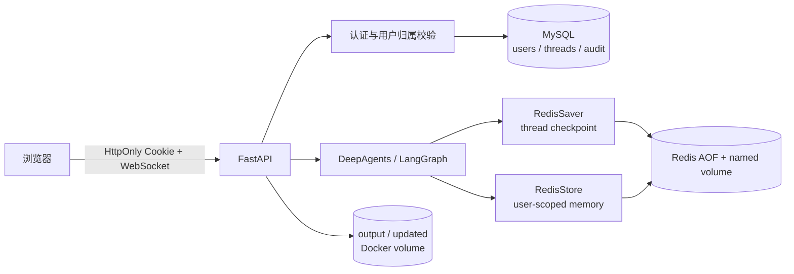

# DeepSearch Agents 第一版长期记忆实施方案

> 状态：设计稿（当前只落地本文档，不修改应用代码）  
> 适用 Compose 项目：`deepsearch-agents`

## 1. 目标与结论

目标是让多个用户可以同时注册、登录，并在后端重启、Redis 重启后继续使用自己的会话和长期记忆。

第一版采用最短可实施路径：

| 数据类型 | 推荐存储 | 作用 |
| --- | --- | --- |
| 用户、密码哈希、会话归属、审计记录 | MySQL | 权威关系数据和用户隔离依据 |
| 当前会话的 LangGraph checkpoint | Redis | 跨后端重启恢复同一个 `thread_id` |
| 用户偏好、确认过的事实、跨会话记忆 | Redis Store | 按 `user_id` 隔离并支持检索 |
| 大规模语义向量、文档知识库 | Qdrant（V1 暂不启用） | 后续需要语义召回时再加入 |
| 上传文件和生成文件 | Docker named volume | 文件持久化，不作为模型记忆 |

核心原则：Redis 负责 Agent 运行时记忆，MySQL 负责“谁拥有这些数据”，后端从登录态取得 `user_id`，不信任前端传入的用户身份。

## 2. 当前项目基线

- `app/agent/main_agent.py` 当前使用 `InMemorySaver()`，只在 Python 进程内保存 checkpoint，后端重启会丢失。
- 当前 `session_id` 同时作为 `thread_id`、输出目录名和 WebSocket 路由标识，但没有 `user_id` 归属校验。
- `app/api/server.py` 的 `active_tasks` 只用于管理当前进程中的运行任务，不是持久化记忆。
- 前端 `localStorage` 只保存浏览器中的 thread ID；它不会保存 Agent 的完整上下文。
- `output/` 和 `updated/` 中的文件是任务产物或上传附件，需要单独做用户/会话归属控制。
- 当前 Compose 已包含：
  - `deepsearch-mysql`：MySQL 8.4；
  - `deepsearch-redis`：Redis 8 Alpine，AOF `everysec`，named volume；
  - Redis 容器内部端口为 `6379`，本机当前映射为 `127.0.0.1:6380`（见 `REDIS_PORT`）。

## 3. V1 架构



### 3.1 Redis 的两个职责

1. **Checkpoint（短期会话记忆）**：使用 `RedisSaver` 替换 `InMemorySaver`。同一个 `thread_id` 的任务可以在后端重启后恢复。
2. **Store（长期记忆）**：使用 `RedisStore` 保存跨 thread 的用户信息。命名空间必须包含后端确认的 `user_id`，例如：

```python
namespace = ("memories", user_id)
```

LangGraph Redis 文档要求 Redis 8.0+，并在启动时执行 `setup()` 创建所需索引；因此 V1 使用的 `redis:8-alpine` 满足版本要求。

### 3.2 MySQL 的职责

MySQL 是账号和归属关系的权威来源，不把密码或密码明文放进 Redis。

建议的最小表：

- `users`：`id`、`email`（或用户名）、`password_hash`、`status`、`created_at`、`updated_at`；
- `agent_threads`：`thread_id`、`user_id`、`title`、`created_at`、`last_used_at`、`status`；
- `auth_sessions`：登录会话/刷新令牌的哈希、过期时间、撤销时间、`user_id`；
- `audit_events`：登录、登出、删除记忆等安全审计事件。

所有用户相关表都通过 `user_id` 建立外键或等价约束。删除用户时，必须同时处理 MySQL 归属记录、Redis 用户命名空间和文件目录。

## 4. 用户注册、登录与任务流程

### 4.1 注册

1. 校验邮箱/用户名格式、唯一性和密码强度。
2. 使用 Argon2id 等现代密码哈希算法保存 `password_hash`，绝不保存明文密码。
3. 在 MySQL 创建用户，生成不可预测的内部 `user_id`（UUID 或雪花 ID）。

### 4.2 登录

1. 查询 MySQL 用户并校验密码哈希。
2. 创建短期 access session，推荐通过 `HttpOnly`、`Secure`、`SameSite` Cookie 传递。
3. 后端请求上下文只注入服务端解析出的 `user_id`。
4. 登出时撤销 `auth_sessions`，而不是仅依赖前端删除 Cookie。

### 4.3 创建任务

1. `/api/task` 从认证上下文取得 `user_id`。
2. 如果客户端提交了 `thread_id`，先查询 `agent_threads`，确认该 thread 属于当前用户；不属于则返回 404/403。
3. 没有 thread 时由后端生成 UUID，并写入 `agent_threads`。
4. 调用 LangGraph 时传入：

```python
config = {
    "configurable": {
        "thread_id": thread_id,
        "user_id": user_id,
    }
}
```

5. Agent 读取长期记忆时只搜索 `("memories", user_id)`；保存记忆时同样使用该命名空间。

### 4.4 文件与 WebSocket

- 上传、列表、下载接口都必须同时校验 `thread_id` 和 `user_id`，目录建议改为 `user_{user_id}/session_{thread_id}`。
- WebSocket 建连时也要校验登录态和 thread 归属，不能仅凭 URL 中的 `thread_id` 接收事件。
- `active_tasks` 可以继续作为本进程的取消索引，但真正的会话状态以 Redis checkpoint 为准。

## 5. 长期记忆写入策略

V1 不把每一轮对话全部写入长期记忆，只保存对未来任务有稳定价值且用户明确同意的信息：

- 用户明确说“记住……”的偏好；
- 用户确认过的个人资料或工作习惯；
- 经用户确认的项目级约束。

每条记忆至少包含：

```json
{
  "type": "preference",
  "content": "用户偏好使用中文回答",
  "source": "explicit_user_request",
  "confidence": 1.0,
  "created_at": "2026-09-05T00:00:00Z",
  "updated_at": "2026-09-05T00:00:00Z"
}
```

建议提供“查看我的记忆”和“删除某条记忆”能力。敏感信息（密码、令牌、银行卡、完整身份证号等）禁止写入长期记忆。

V1 的召回规则：每次任务最多取少量与当前问题相关的记忆，放入系统提示词；召回失败不能把其他用户的数据作为兜底结果。

## 6. Docker 与配置约定

### 6.1 服务命名

Compose 项目名保持 `deepsearch-agents`，服务名和容器名保持职责分离：

- `deepsearch-mysql`；
- `deepsearch-redis`；
- 后续增加 `deepsearch-agents-backend`、`deepsearch-agents-frontend`。

应用容器访问 Redis 使用 Compose DNS：

```text
redis://redis:6379/0
```

本机直接运行后端时使用：

```text
redis://127.0.0.1:6380/0
```

当前 Redis 端口变量表示**宿主机映射端口**：

```dotenv
REDIS_PORT=6380
```

后续如果同时支持容器内和本机运行，建议把变量拆成 `REDIS_HOST_PORT` 与 `REDIS_URL`，避免把宿主机端口误当成容器端口。

### 6.2 持久化与安全

- Redis 使用 AOF `appendonly yes`、`appendfsync everysec`，数据写入 named volume；
- 不执行 `docker compose down -v`，否则会删除 MySQL/Redis 数据卷；
- 当前端口绑定到 `127.0.0.1`，仅用于本机开发；部署到服务器时应使用 Redis 密码、私有网络和防火墙规则；
- 生产环境需定期备份 AOF/快照，并演练恢复；`everysec` 仍存在约一秒的数据丢失窗口。

## 7. 分阶段实施顺序

### 阶段 0：基础设施（已完成）

- Compose 加入 Redis 8 服务；
- 创建 `deepsearch_redis_data` named volume；
- 健康检查 `redis-cli ping`；
- 验证容器状态为 `healthy`，并验证 `PONG`。

### 阶段 1：Redis LangGraph 持久化

- 增加与当前 LangGraph 版本兼容的 `langgraph-checkpoint-redis` 依赖；
- 在应用生命周期中创建单例 `RedisSaver` 和 `RedisStore`；
- 启动时执行一次 `setup()`；
- 将 `InMemorySaver()` 替换为 Redis checkpointer；
- 保留 `thread_id` 作为会话恢复键。

### 阶段 2：MySQL 认证与归属

- 创建 `users`、`auth_sessions`、`agent_threads`、`audit_events` 表；
- 增加注册、登录、登出、当前用户接口；
- 引入密码哈希、会话过期和登录失败限流；
- 给任务、文件、WebSocket 接口增加用户归属检查。

### 阶段 3：用户级长期记忆

- 将后端认证得到的 `user_id` 注入 Agent 运行上下文；
- 使用 `("memories", user_id)` 作为 Redis Store 命名空间；
- 实现显式“记住/忘记”、记忆查询和删除；
- 增加记忆大小、类型和敏感内容校验。

### 阶段 4：前端多用户体验

- 增加注册、登录、登出页面；
- 登录后由后端返回用户信息，前端不自行生成或提交 `user_id`；
- 用户切换或登出时清理本地 thread ID，重新从后端加载该用户的 thread 列表；
- WebSocket 连接携带登录态并处理过期重连。

## 8. 错误处理与可观测性

- Redis checkpointer 不可用：任务接口返回 503，不静默退回 `InMemorySaver`，避免用户误以为记忆已保存。
- Redis Store 读失败：任务可以继续，但必须记录告警并向前端提示“本次未加载长期记忆”。
- Redis Store 写失败：明确返回保存失败，不向用户宣称“已经记住”。
- MySQL 不可用：注册、登录和需要用户归属校验的请求返回 503。
- 记录 `user_id`、`thread_id`、请求耗时和错误类型；日志中不得打印密码、Cookie、令牌或完整记忆内容。

## 9. 验收标准

1. 两个用户可以同时注册、登录并运行任务，任务互不覆盖。
2. 用户 A 的 thread、文件和长期记忆对用户 B 不可见。
3. 后端重启后，同一个 `thread_id` 能从 Redis checkpoint 继续运行。
4. 新建 thread 时，用户可以召回自己此前明确保存的偏好；不能召回其他用户的偏好。
5. Redis 重启后，named volume 中的数据仍可恢复。
6. Redis 不可用时不会静默降级到进程内记忆。
7. 删除记忆后，后续任务不再召回该记忆。
8. MySQL 和 Redis 数据卷未被普通的 `docker compose down` 删除。

## 10. 暂不做的内容

- V1 不引入 Qdrant。只有当记忆数量明显增长、需要按语义相似度搜索，或需要对上传文档做向量检索时，再增加 Qdrant 服务和异步 embedding 管道。
- V1 不做多租户组织、角色权限、OAuth/SSO、复杂记忆自动总结和跨用户共享记忆。
- V1 不把 Redis 当作用户账号的唯一存储，也不把 MySQL 当作 LangGraph checkpoint 的首选实现。

## 11. 参考资料

- LangGraph Redis：<https://github.com/redis-developer/langgraph-redis>
- Redis 持久化与 AOF：<https://redis.io/docs/latest/operate/oss_and_stack/management/persistence/>
- 当前 Compose：`docker/docker-compose.yaml`

